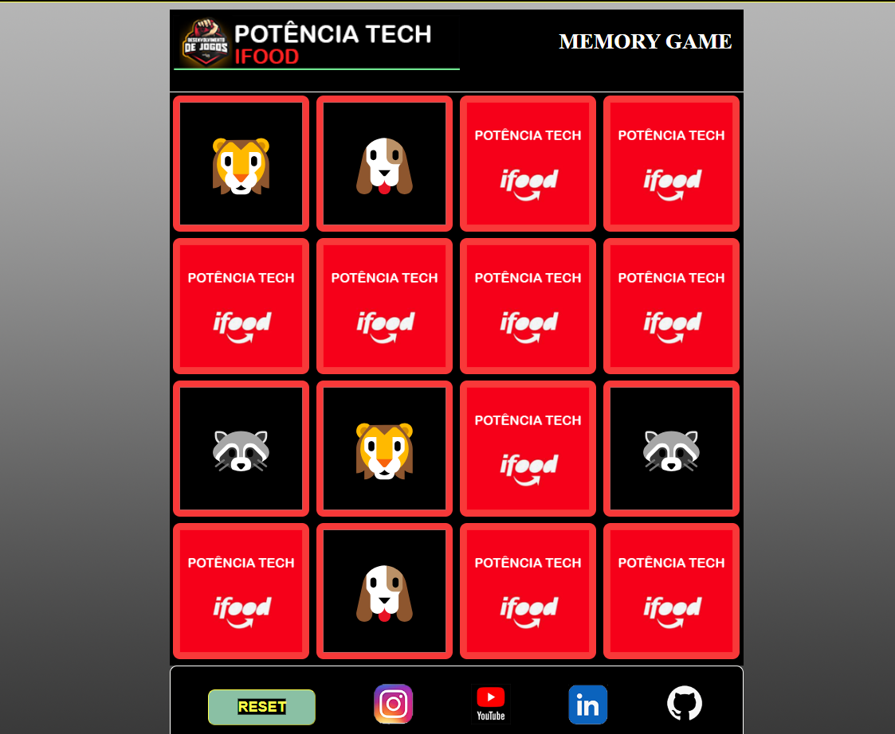

# POTÊNCIA TECH IFOOD - EMOJI MEMORY GAME

# Sobre
Projeto desenvolvido durante os desafios do bootcamp Desenvolvimento de Jogos da escola dio.me em parceria com Potência Tech by IFood.

# Informações
Nome : Emojy Memory Game
Gênero: raciocínio-lógico
Plataforma: Web
Tecnologias: Html 5, CSS e JavaScript

# Tela do jogo

# EMOGI MEMORY GAME

# 1.1 - CONCEITO
Tradicional jogo da memória com cartas.

# 1.2 - GÊNERO
É um jogo de raciocínio lógico.

# 1.3 – PÚBLICO
O público-alvo do jogo é para qualquer idade. 

# 1.4 – ARQUITETURA
O jogo será desenvolvido para web, utilizando com tecnologias HTML 5, CSS 3 e JAVASCRIPT para browser, tais como, Google Chrone, IE, Firefox, entre outros.

# - 1.4.1 – Requisitos para rodar o jogo
Qualquer computador, tablet ou smartphone com acesso a internet e qualquer browser.

# 1.5 – CARACTERÍSTICAS
O jogo será desenvolvido no formato 2D, com tela e cartas em art digital.

# 2.1– OBJETIVOS
 - Principal – Desvirar as cartas e descobrir o par de cartas correta.

